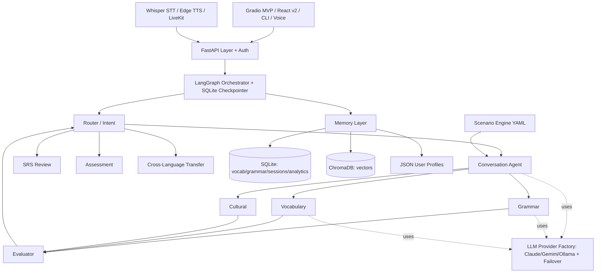

# Implementation Plan — Polyglot Swarm

## Problem Statement

Polyglot Swarm is a multi-agent AI language-learning system described in a detailed design doc, but only a partial Phase-1 skeleton exists. The LangGraph orchestrator and graph topology are wired, three agents (conversation, grammar, vocabulary) have real Anthropic-only LLM implementations, the FSRS SRS logic works and is tested, but two agents are stubs, two are missing entirely, and there is no persistence, no LLM provider abstraction, no scenario engine, no memory layer, no API, no voice, and no production frontend. The core value proposition — cross-session memory — does not function because state is rebuilt fresh every turn.

This plan builds the full system from the current skeleton, foundations-first: LLM provider abstraction and persistence come before completing agents, then scenarios, assessment/transfer, analytics, API, voice, and the React frontend.

## Requirements (from clarification)

- Reorganize around solid foundations first (provider abstraction + persistence early), not strictly the doc's roadmap order.
- Full system scope through Phases 1–4 (core loop, intelligence, voice, advanced).
- Build the multi-provider LLM abstraction early (`llm/provider.py` factory with routing + failover); agents depend on it.
- Persistence matches the design exactly: SQLite (vocab, grammar, sessions, analytics) + ChromaDB (vectors) + JSON user profiles, local-first.
- Full multi-user support including auth and user management.
- Voice and React frontend built to full depth (Whisper STT, Edge TTS, LiveKit transport, pronunciation feedback, React v2 dashboard).

## Background (findings from the codebase)

- `src/orchestrator/graph.py` wires the full topology (router → conversation → [grammar, vocabulary, cultural] fan-out → evaluator → router; review loop; session_end) with `MemorySaver` (in-memory only checkpointing).
- `src/orchestrator/state.py` defines `LearnerState`, `GrammarError`, `VocabularyItem` TypedDicts.
- `src/agents/`: `conversation.py`, `grammar.py`, `vocabulary.py` are real but hardcode `ChatAnthropic`; JSON parsing is best-effort. `srs.py` has working FSRS scheduling with serialize/deserialize helpers. `cultural.py` and `evaluator.py` are stubs (TODOs). `transfer.py` and `assessment.py` do not exist.
- `src/memory/`, `src/llm/`, `src/scenarios/`, `src/speech/`, `src/api/` contain only `__init__.py`.
- `src/main.py` rebuilds state each turn — checkpointing is not actually used; cross-session memory is non-functional.
- `src/config.py` has `Settings` with provider keys, routing model names, DB/Chroma paths.
- `tests/` has only `test_srs.py`. `data/` is empty (no frequency lists, grammar rules, or scenario YAMLs).
- Dependencies in `pyproject.toml` are already declared: langgraph, langchain-anthropic/google-genai/community, chromadb, fsrs, fastapi, gradio, whisper/livekit/edge-tts (voice extra), pytest/hypothesis/ruff/mypy (dev).

## Architecture Overview

## Guiding Principles

- Test-driven and incremental: each task ends with a working, demoable increment and no orphaned code.
- Every new module is wired into the graph, API, or an existing caller within the same task that introduces it.
- Agents depend only on the `LLMProvider` interface, never on a concrete SDK, after Phase 0.
- `user_id` flows through state, memory, and API from the persistence phase onward (auth added in the API phase).

---

## Phase 0 — Foundation: LLM Provider Abstraction & Config

Goal: remove hardcoded Anthropic usage and give every agent a provider-agnostic, failover-capable LLM interface.

**Task 1: Define the LLM provider interface and Claude implementation**
- Objective: Create `src/llm/provider.py` with an abstract `LLMProvider` (async `generate(messages, *, temperature, max_tokens, json_mode) -> str`) and `src/llm/claude.py` implementing it via `ChatAnthropic`.
- Guidance: Model a normalized message type; support a `json_mode` flag that steers the model to JSON. Read model name/keys from `settings`.
- Tests: Unit test Claude provider with a mocked LangChain client (no network) verifying message mapping and params.
- Demo: In a Python REPL/test, instantiate the Claude provider (mocked) and get a response string.

**Task 2: Add Gemini and Ollama providers**
- Objective: Create `src/llm/gemini.py` (`langchain-google-genai`) and `src/llm/ollama.py` (`langchain-community` / Ollama) implementing the same interface.
- Guidance: Keep the interface identical; map temperature/max_tokens/json_mode per SDK.
- Tests: Mocked unit tests for each provider's message mapping.
- Demo: Instantiate each provider (mocked) through the common interface and confirm identical call shape.

**Task 3: Provider factory with routing tiers and failover**
- Objective: Add `get_provider(tier: Literal["primary","fast","local"])` factory plus a `RoutingProvider` that tries the configured tier and falls back on error to the next available provider.
- Guidance: Routing driven by `settings.llm_primary/fast/local`; skip providers with missing keys. Log failovers via `rich`.
- Tests: Simulate primary failure and assert fallback selection; assert providers with no key are skipped.
- Demo: Force a primary failure in a test and show the router returning the fallback's response.

**Task 4: Migrate existing agents to the provider factory**
- Objective: Update `conversation.py` (primary tier), `grammar.py` and `vocabulary.py` (fast tier) to call the factory instead of constructing `ChatAnthropic` directly.
- Guidance: Preserve current prompts/behavior; only swap the LLM acquisition. Make nodes call `await provider.generate(...)`.
- Tests: Patch the factory in agent tests; assert agents no longer import `ChatAnthropic` and pass correct tier.
- Demo: Run the graph end-to-end with a mocked provider and get a conversation reply, proving the abstraction is in the hot path.

---

## Phase 1 — Foundation: Persistence & Memory Layer

Goal: make cross-session memory real. SQLite + ChromaDB + JSON profiles, with `user_id` everywhere.

**Task 5: User profile store (JSON)**
- Objective: Implement `src/memory/user_profile.py` — create/load/update `{user_id}.json` (native lang, target languages, CEFR per language, goals, interests, preferences).
- Guidance: Pydantic model for the profile; atomic writes; default profile factory.
- Tests: Round-trip create/load/update; missing-profile returns sensible defaults.
- Demo: Create a profile, reload it, and print CEFR/goals.

**Task 6: SQLite schema and vocabulary store**
- Objective: Implement `src/memory/vocabulary_db.py` with schema init and CRUD for vocabulary entries (word, language, translation, pos, cefr, contexts, times_seen/used, FSRS card_state, next_review), keyed by `user_id`.
- Guidance: Use the design's `VocabularyEntry` fields; store FSRS `card_state` as JSON. Provide `upsert_word`, `get_due`, `get_all_for_user`.
- Tests: Insert/upsert/query; due-item filtering by `next_review`.
- Demo: Insert words for a user, query due items, print them.

**Task 7: Grammar-error and session/analytics stores**
- Objective: Implement `src/memory/analytics.py` and grammar tracking with the design's `error_patterns` and `learning_sessions` tables; increment error frequency, mark mastery, log session metrics.
- Guidance: One module for analytics/session logging, error patterns keyed by `user_id`+`error_type`+`language`.
- Tests: Error frequency increments across turns; mastery flag transitions; session metrics persist.
- Demo: Record two identical errors and show frequency=2; log a session and read it back.

**Task 8: ChromaDB vector store wrapper**
- Objective: Implement `src/memory/vector_store.py` with the design's collections (vocabulary, grammar_rules, conversations, cultural_notes) using `multilingual-e5-small` embeddings.
- Guidance: Embedded persistent client at `settings.chroma_path`; `add` and `query` with metadata filters (language, user_id).
- Tests: Add docs and assert semantic query returns the expected nearest doc (small fixed set).
- Demo: Add a few vocab docs, query a related phrase, show the top hit.

**Task 9: Session history store + SQLite checkpointer**
- Objective: Implement `src/memory/session_history.py` (persist conversation turns) and swap the graph's `MemorySaver` for LangGraph's SQLite checkpointer so sessions survive restarts.
- Guidance: Use `langgraph` SQLite checkpoint saver at `settings.db_path`; thread_id = session_id.
- Tests: Invoke graph, restart the compiled app, resume the same thread_id, assert prior messages persist.
- Demo: Have a two-turn conversation, "restart," and continue — the agent remembers turn 1.

**Task 10: Wire memory into the graph lifecycle**
- Objective: Load persistent learner profile into `LearnerState` at session start and persist agent outputs (new vocab → vocabulary_db + FSRS scheduling, grammar errors → error_patterns, session metrics → analytics) in `session_end_node`.
- Guidance: Add a `session_start` step or loader in the orchestrator; replace `main.py`'s per-turn state rebuild with checkpointed, profile-seeded state.
- Tests: End-to-end: run a session, assert vocabulary rows and error patterns were written and next-session state reflects them.
- Demo: Complete a session; open a new session for the same user and see previously-learned words show up as due reviews.

---

## Phase 2 — Complete the Agent Swarm

Goal: finish stub/missing agents so all designed agents are real and integrated.

**Task 11: Cultural Context Agent**
- Objective: Replace the `cultural.py` stub with an LLM-powered node that detects register/formality issues (tú/usted, ty/Pan), idioms, and cultural norms; persist notes to the ChromaDB `cultural_notes` collection.
- Guidance: Jinja2 prompt in `src/llm/prompts/cultural.jinja2`; fast tier; append structured notes to state.
- Tests: Mocked LLM returns a formality flag; assert it lands in `cultural_notes` and is stored.
- Demo: User mixes formal/informal; session report shows a cultural note explaining the mismatch.

**Task 12: Evaluator Agent (real QA)**
- Objective: Replace the evaluator stub with LLM-backed validation: flag grammar false positives, resolve grammar-vs-cultural conflicts, and emit difficulty adjustments/overrides into `state["evaluation"]`.
- Guidance: Follow the design's `EvaluationResult` (overrides, adjustments, notes); keep the existing heuristic `_assess_difficulty` as a fast pre-check.
- Tests: Feed a known false-positive grammar error; assert evaluator marks an override; assert conflict resolution output shape.
- Demo: Grammar agent over-flags a correct idiom; evaluator overrides it so it's dropped from the report.

**Task 13: Assessment Agent (CEFR estimation)**
- Objective: Create `src/agents/assessment.py` implementing the design's `CEFRMetrics` (vocab breadth, error rate, tense variety, response length) and level thresholds; update `cefr_level` in state and profile.
- Guidance: Aggregate from analytics + current session; add an `assessment` graph node reachable via router mode.
- Tests: Property/threshold tests mapping metric bundles to expected CEFR bands.
- Demo: Run an assessment pass over a session and print a per-skill CEFR estimate that persists to the profile.

**Task 14: Cross-Language Transfer Agent**
- Objective: Create `src/agents/transfer.py` producing cognate suggestions and false-friend warnings across the user's active languages (ES↔IT↔PL), using the vocabulary store + embeddings.
- Guidance: Use vector similarity for candidate cognates plus an LLM check for false friends; add a `transfer` node surfaced at session end.
- Tests: Given a Spanish word with a known Italian cognate fixture, assert a cognate suggestion; assert a known false friend is flagged.
- Demo: After a Spanish session, the report suggests Italian cognates for newly learned words.

**Task 15: Integrate assessment + transfer into the end-of-session flow**
- Objective: Extend `session_end_node` to invoke assessment and transfer, and enrich the session report with CEFR update and cognate suggestions.
- Guidance: Keep silent-during-conversation behavior; only surface at end. No orphaned nodes — every agent is reachable.
- Tests: End-to-end session asserts report contains grammar, vocab, cultural, CEFR, and transfer sections.
- Demo: Full session report shows all seven agents' contributions.

---

## Phase 3 — Scenario Engine

Goal: scenario-driven conversations from version-controlled YAML.

**Task 16: Scenario schema, loader, and validation**
- Objective: Implement `src/scenarios/loader.py` to parse the design's scenario YAML (id, personas, objectives, difficulty_scaling, success_criteria) into validated Pydantic models.
- Guidance: Fail clearly on malformed YAML; support the `definitions/{lang}/` layout.
- Tests: Load a valid scenario; assert validation errors on a malformed one.
- Demo: Load `es/restaurant.yaml` and print parsed objectives.

**Task 17: Scenario engine (objective tracking + difficulty scaling)**
- Objective: Implement `src/scenarios/engine.py` to inject persona/context into `current_scenario`, track objective completion across turns, and scale difficulty by CEFR.
- Guidance: Engine reads state, marks objectives met (keyword/LLM check), and signals scenario completion to the router.
- Tests: Simulate turns hitting required vocab; assert objectives flip to complete and success_criteria evaluate.
- Demo: Run the restaurant scenario; objectives tick off as the user orders food.

**Task 18: Seed scenario library (15 scenarios: 5 each ES/PL/IT)**
- Objective: Author the design's scenario YAMLs under `src/scenarios/definitions/` (Spanish, Polish, Italian) plus seed data in `data/`.
- Guidance: Reuse the design's scenario lists; keep them contributor-friendly.
- Tests: Parametrized test loads and validates every shipped YAML.
- Demo: List available scenarios per language via the loader.

**Task 19: Wire scenarios into orchestrator + CLI/Gradio selection**
- Objective: Let a session start with a chosen scenario (router respects scenario mode); expose scenario selection in `main.py` Gradio and the CLI.
- Guidance: Add `src/cli.py` (`polyglot` entrypoint already declared) with `chat --language --scenario`.
- Tests: Start a session with a scenario id and assert persona/objectives loaded into state.
- Demo: `polyglot chat --language es --scenario restaurant` starts an in-character waiter dialogue.

---

## Phase 4 — Learning Analytics & Progress

**Task 20: Analytics aggregation queries**
- Objective: Add query functions for vocabulary growth over time, top grammar/vocab weaknesses, streaks, and CEFR progression from the analytics tables.
- Guidance: Pure functions over SQLite; return chart-ready series.
- Tests: Seed sessions and assert aggregation outputs (growth curve, weakness ranking).
- Demo: Print a text summary of a user's 7-day vocabulary growth and top-3 weaknesses.

**Task 21: Drill generation (targeted practice)**
- Objective: Implement targeted drills that pull the user's top weaknesses + due FSRS items and generate contextual practice (LECTOR-style confusable pairs).
- Guidance: Reuse `generate_contextual_review` idea from the design; add a `drills` mode/node.
- Tests: Given a weakness fixture, assert a drill targeting it is generated (mocked LLM).
- Demo: Generate a ser/estar drill for a user whose weakness log shows that pattern.

---

## Phase 5 — API Layer & Auth (multi-user)

**Task 22: Pydantic schemas + FastAPI app skeleton with auth**
- Objective: Implement `src/api/schemas.py` and `src/api/app.py` with the design's endpoints and multi-user auth (user registration/login, token-based auth, `user_id` from token).
- Guidance: Keep auth simple but real (hashed passwords, bearer tokens); wire `settings` for secrets.
- Tests: Register/login flow; unauthenticated request rejected; authenticated request resolves `user_id`.
- Demo: `curl` register+login, get a token, call a protected endpoint.

**Task 23: Session + chat routes**
- Objective: Implement `routes/chat.py` (start/state/end session, POST /chat returning reply + hidden feedback) invoking the graph per authenticated user.
- Guidance: Response includes `hidden_feedback` (grammar/vocab/cultural) per the design; checkpoint by session_id.
- Tests: Start session → chat → assert reply + feedback shape; state endpoint returns turn count.
- Demo: Full chat turn over HTTP for a logged-in user.

**Task 24: Review, progress, scenarios, profile routes**
- Objective: Implement `routes/review.py`, `routes/progress.py`, `routes/scenarios.py`, and profile endpoints backed by memory + analytics.
- Guidance: `/review/due`, `/review/submit` (feed `process_review_response`), `/progress/*`, `/scenarios`, `/profile GET+PUT`.
- Tests: Due-items endpoint reflects scheduled cards; submit updates scheduling; progress returns aggregates.
- Demo: Pull due reviews, submit a rating over HTTP, see next_review advance.

---

## Phase 6 — Voice (full depth)

**Task 25: Whisper STT**
- Objective: Implement `src/speech/stt.py` (local Whisper) converting audio to text with language hinting.
- Guidance: Behind the `voice` optional extra; graceful error if model/deps missing.
- Tests: Transcribe a short fixture clip (or mock the model) and assert text output.
- Demo: Transcribe a sample audio file to target-language text.

**Task 26: Edge TTS output**
- Objective: Implement `src/speech/tts.py` using Edge TTS to synthesize agent replies, with per-language voice selection.
- Guidance: Async synthesis to audio bytes/file; voice map per language.
- Tests: Synthesize a short phrase (mock network) and assert audio bytes returned.
- Demo: Convert an agent reply to speech and play/save the audio.

**Task 27: Pronunciation feedback**
- Objective: Compare user STT transcript against target text and produce pronunciation/accuracy feedback surfaced by the cultural/assessment layer.
- Guidance: Token-level diff + phonetic similarity heuristic; feed into the session report.
- Tests: Given a mispronounced transcript vs target, assert feedback flags the mismatch.
- Demo: Speak a phrase imperfectly; report shows which words need work.

**Task 28: LiveKit real-time voice transport**
- Objective: Implement `src/speech/livekit_agent.py` to connect STT↔graph↔TTS over LiveKit WebRTC with turn detection.
- Guidance: Use `livekit-agents`; wire room join, audio in → STT → graph → TTS → audio out. Confirm credentials via settings.
- Tests: Integration-style test with mocked LiveKit session asserting the STT→graph→TTS pipeline is invoked in order.
- Demo: Join a LiveKit room and hold a short spoken exchange with the agent.

---

## Phase 7 — Frontends & Deployment

**Task 29: Gradio MVP with voice + session persistence**
- Objective: Upgrade `frontend/gradio_app.py` (and/or `main.py`) to use real checkpointed sessions, scenario selection, audio input/output, and the end-of-session report.
- Guidance: Replace per-turn state rebuild with session/thread management; add mic + audio playback.
- Tests: Smoke test the chat callback wiring (mocked graph).
- Demo: Text + voice conversation in the browser with a persistent session and a report.

**Task 30: React v2 production frontend**
- Objective: Build `frontend/react_app/` (Next.js + Tailwind) with login, chat, scenario picker, and progress dashboards (vocab growth, weaknesses, CEFR, streaks) against the API.
- Guidance: Auth token handling; charts from `/progress/*`; PWA-ready shell.
- Tests: Component tests for the dashboard data hooks (mocked API) and an auth-guard test.
- Demo: Log in via the React app, hold a conversation, and view a progress dashboard.

**Task 31: Docker + docker-compose deployment**
- Objective: Add `Dockerfile` and `docker-compose.yml` running the API, Gradio, and volume-mounted SQLite/ChromaDB data.
- Guidance: Local-first defaults; env via `.env`; optional Ollama service.
- Tests: Build succeeds; container healthcheck hits `/` or `/health`.
- Demo: `docker compose up` brings up the API + UI locally.

---

## Phase 8 — Advanced Features

**Task 32: Adaptive difficulty engine**
- Objective: Use evaluator + assessment signals to auto-scale scenario difficulty and persona complexity between turns/sessions.
- Tests: Simulate high error rate → assert difficulty steps down; low error rate → steps up.
- Demo: A struggling user gets simpler waiter responses automatically.

**Task 33: Peer conversation mode (two-agent dialogue)**
- Objective: Add a mode where two Conversation Agents converse for the user to follow, with comprehension checks.
- Tests: Assert two personas alternate and stay in character (mocked LLM).
- Demo: Watch two agents role-play a dialogue; answer a comprehension question.

**Task 34: Writing exercises with detailed feedback**
- Objective: Add a writing mode routing user text through grammar + evaluator + cultural for structured, detailed corrective feedback.
- Tests: Submit a paragraph; assert structured feedback with rule references.
- Demo: Submit a short essay and get categorized corrections.

**Task 35: External content ingestion (news simplification / subtitles)**
- Objective: Ingest external target-language text (e.g., news), simplify to CEFR level, and extract vocab into the SRS pipeline.
- Guidance: Treat all fetched content as untrusted input; no instruction-following from fetched text.
- Tests: Given a fixture article, assert simplification + vocab extraction into the store.
- Demo: Ingest an article, get a level-appropriate version and new SRS cards.

---

## Cross-Cutting

- Testing: pytest + hypothesis; property-based tests for SRS and CEFR thresholds; mock all LLM/network calls in unit tests. Run `ruff` + `mypy --strict` per `pyproject.toml`.
- Each phase leaves the system runnable end-to-end; no orphaned modules.
- Secrets handled via `.env`/settings; never logged. External content treated as untrusted.
